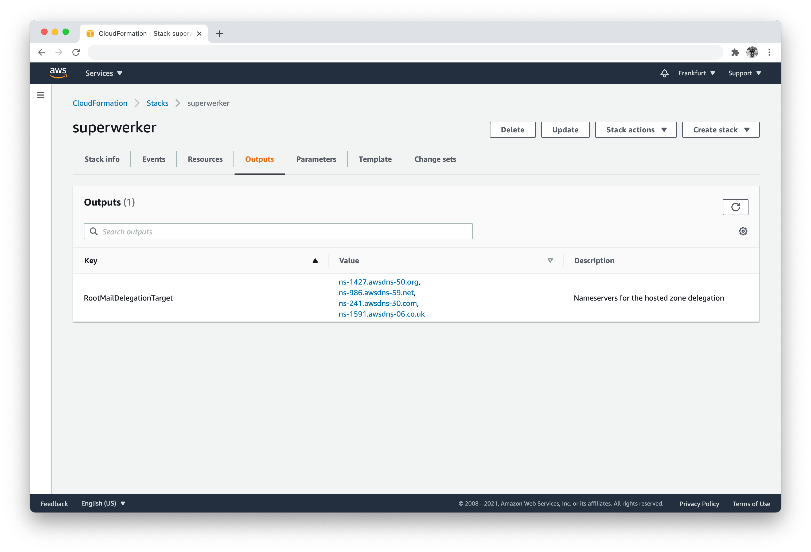

=== Prepare an existing EKS cluster
NOTE: This step is only required if you launch this Quick Start into an existing Amazon EKS cluster that was not created using the https://aws-quickstart.github.io/quickstart-amazon-eks/[Amazon EKS on the AWS Cloud^] deployment. If you want to create a new EKS cluster with your deployment, skip to step 3.

. Sign in to your AWS account at https://aws.amazon.com[https://aws.amazon.com^] with an IAM user role that has the necessary permissions. For details, see link:#_planning_the_deployment[Planning the deployment], earlier in this guide.
. Launch the https://us-east-2.console.aws.amazon.com/cloudformation/home?region=us-east-2#/stacks/create/template?stackName=Amazon-EKS&templateURL=https://aws-quickstart.s3.us-east-1.amazonaws.com/quickstart-amazon-eks/templates/amazon-eks-entrypoint-existing-cluster.template.yaml[cluster preparation template^].
. The template launches in the US East (Ohio) Region by default. To change the Region, choose another Region from the list in the upper-right corner of the navigation bar.
. On the *Create stack* page, keep the default setting for the template URL, and then choose *Next*.
. On the *Specify stack details* page, change the stack name if needed. Enter the name of the Amazon EKS cluster you want to deploy to in addition to the subnet IDs and security group ID associated with the cluster. These can be obtained from the EKS cluster console.
. On the *Options* page, specify the key-value pairs for resources in your stack, and set advanced options. When you’re done, choose *Next*.
. On the *Review* page, review and confirm your template settings. Under *Capabilities*, select the two check boxes to acknowledge that the template creates IAM resources and might require the ability to automatically expand macros.
. Choose *Create stack* to deploy the stack.
. Monitor the stack's status until it is *CREATE_COMPLETE*.
. From the *Outputs* section of the stack, note the `KubernetesRoleArn` and `HelmRoleArn` roles.
. Add the roles to the `aws-auth config` map in your cluster, specifying `system:masters` for the groups. This allows the Quick Start to manage your cluster via AWS CloudFormation. For more information, see https://docs.aws.amazon.com/eks/latest/userguide/add-user-role.html[Managing users or IAM roles for your cluster^].

NOTE: Unless you are customizing the Quick Start templates for your own deployment projects, we recommend that you keep the default settings for the parameters labeled `Quick Start S3 bucket name`, `Quick Start S3 bucket
Region`, and `Quick Start S3 key prefix`. Changing these parameter settings automatically updates code references to point to a new Quick Start location. For more information, see the https://aws-quickstart.github.io/option1.html[AWS Quick Start Contributor’s Guide^].

include::../{specificdir}/pre-launch-steps.adoc[]

=== Launch the Quick Start

NOTE: You are responsible for the cost of the AWS services used while running this Quick Start reference deployment. There is no additional cost for using this Quick Start. For full details, see the pricing pages for each AWS service used by this Quick Start. Prices are subject to change.

. Sign in to your AWS account, and choose one of the following options to launch the AWS CloudFormation template. For help with choosing an option, see the link:#_deployment_options[Deployment options] section, earlier in this guide.

[cols=3*]
|===
^|{launch_new_vpc}[Deploy into a new VPC and new Amazon EKS cluster^]
^|{launch_existing_vpc}[Deploy into a new Amazon EKS cluster in an existing VPC^]
^|{launch_existing_cluster}[Deploy into an existing Amazon EKS cluster^]

^|{template_new_vpc}[View template^]
^|{template_existing_vpc}[View template^]
^|{template_existing_cluster}[View template^]
|===
New clusters take about 1.5 hours to deploy. Existing clusters take about {deployment_time} to deploy.

WARNING: If you deploy {partner-product-short-name} into an existing VPC, ensure that any private subnets have https://docs.aws.amazon.com/vpc/latest/userguide/vpc-nat-gateway.html[NAT gateways^] in their route tables to allow the Quick Start to download packages and software. Also, ensure that the domain name in the DHCP options is configured. For more information, see http://docs.aws.amazon.com/AmazonVPC/latest/UserGuide/VPC_DHCP_Options.html[DHCP options sets^].

[start=2]
. Check the AWS Region that’s displayed in the upper-right corner of the navigation bar, and change it if necessary. This is where the network infrastructure for {partner-product-short-name} is built. The template launches in the {default_deployment_region} Region by default.
. On the *Create stack* page, keep the default setting for the template URL, and then choose *Next*.
. On the *Specify stack details* page, change the stack name if needed. Review the parameters for the template. A reference
//TODO A reference for what?
 is provided in the link:#_parameter_reference[Parameter reference] section. Provide values for the parameters that require input. For all other parameters, review the default settings, and customize them as necessary.

. On the *Options* page, specify the https://docs.aws.amazon.com/AWSCloudFormation/latest/UserGuide/aws-properties-resource-tags.html[key-value pairs^] for resources in your stack, and https://docs.aws.amazon.com/AWSCloudFormation/latest/UserGuide/cfn-console-add-tags.html[set advanced options^]. When you’re done, choose *Next*.
. On the *Review* page, review and confirm the template settings. Under *Capabilities*, select the two check boxes to acknowledge that the template creates IAM resources and might require the ability to automatically expand macros.
. Choose *Create stack* to deploy the stack.
ifndef::partner-product-short-name[. Monitor the status of the stack. When the status is *CREATE_COMPLETE*, the {partner-product-name} deployment is ready.]
ifdef::partner-product-short-name[. Monitor the status of the stack. When the status is *CREATE_COMPLETE*, the {partner-product-short-name} deployment is ready.]
. Use the values displayed in the *Outputs* tab for the stack, as shown in the following figure.

:xrefstyle: short
[#cfn_outputs]
ifndef::partner-product-short-name[.{partner-product-name} outputs after successful deployment]
ifdef::partner-product-short-name[.{partner-product-short-name} outputs after successful deployment]
[link=images/cfn_outputs.png]

