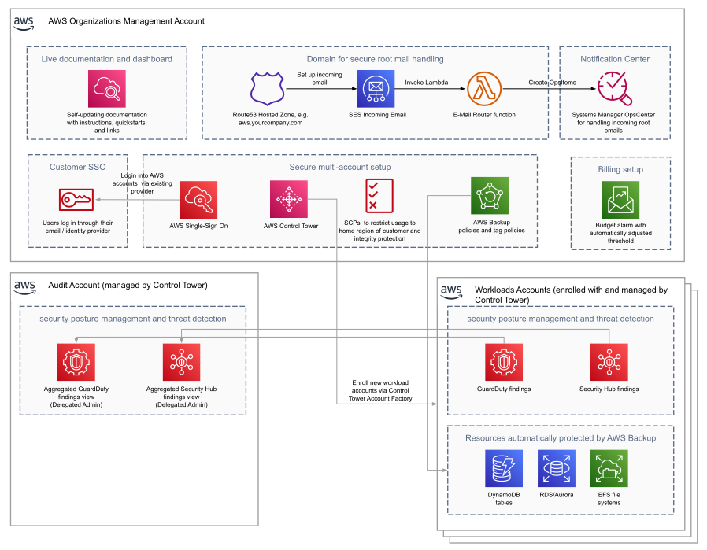

Deploying this Quick Start builds the following {partner-product-short-name} environment in the
AWS Cloud.

// Replace this example diagram with your own. Send us your source PowerPoint file. Be sure to follow our guidelines here : http://(we should include these points on our contributors giude)
:xrefstyle: short
[#architecture1]
.Quick Start architecture for {partner-product-short-name} on AWS

As shown in <<architecture1>>, the Quick Start configures the following AWS services and features in a fully automated way:

- AWS Control Tower and AWS Single Sign-On as the basis for a future-proof multi-account setup
- Amazon GuardDuty for automatic detection of possible threats breaches
- AWS Security Hub to ensure established security standards
- AWS Backup for automated creation of backups
- Budget alarm for cost control
- Service control policies to protect the infrastructure from intentional or unintentional mistakes, e.g. deny use of non allowed AWS regions, deletion of backup copies, deactivation of security features
- AWS Systems Manager OpsCenter/Items notification aggregation and incident response handling
- Secure mailboxes and service catalogue aliases for all root accounts
- A CloudWatch dashboard with more information and deep-links to resources, e.g. setting up SSO with existing identity providers, GuardDuty/Security Hub dashboards, AWS account setup

Feature flippers can be used to gradually opt into functionality.
